


  <a href="https://deepak420-grandmaster.github.io/Deepak_Prajapati_portfolio.github.io/">🌐 Portfolio</a>
  &nbsp;·&nbsp;
  <a href="https://www.linkedin.com/in/deepak-prajapati-695963204">💼 LinkedIn</a>
  &nbsp;·&nbsp;
  <a href="mailto:deepak.byte07@gmail.com">📧 Email</a>





<table>
  <tr>
    <td width="33%"><a href="https://github.com/Deepak420-GrandMaster/Airbnb-agentic-rag"></a></td>
    <td width="33%"><a href="https://github.com/Deepak420-GrandMaster/Agentic-AI"></a></td>
    <td width="33%"><a href="https://github.com/Deepak420-GrandMaster/Stock-Market-Analysis"></a></td>
  </tr>
  <tr>
    <td width="33%"><a href="https://github.com/Deepak420-GrandMaster/Fraud-Detection"></a></td>
    <td width="33%"><a href="https://github.com/Deepak420-GrandMaster/Flight-Fare-Prediction"></a></td>
    <td width="33%"><a href="https://github.com/Deepak420-GrandMaster/SQL-Project"></a></td>
  </tr>
</table>

